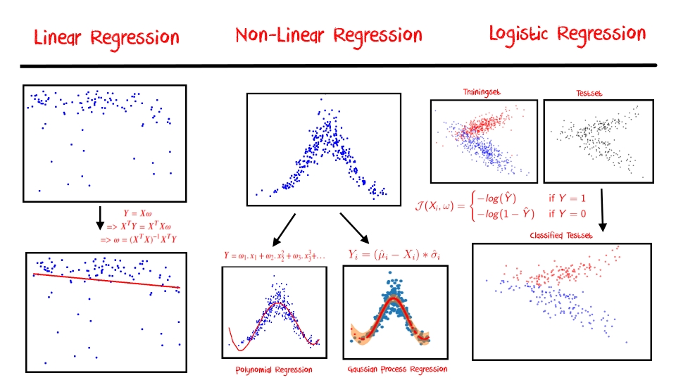

# ML Basics (Part-1): REGRESSION — A Gateway Method to Machine Learning
## An easy and comprehensive introduction to Linear, Non-Linear and Logistic Regression

## Requirements

* Python 3
* scikit-learn

## Running The Notebook

* Open the Notebook in Google Colab or local jupyter server
* Install the requirements
* Restart the kernel if necessary 

## The tutorial 📃

The full tutorial is available on following links:

On Medium:

https://azad-wolf.medium.com/ml-basics-part-1-regression-a-gateway-method-to-machine-learning-36d54d233907

On Substack:

https://azadwolf.substack.com/p/ml-basics-part-1-regression-a-gateway

